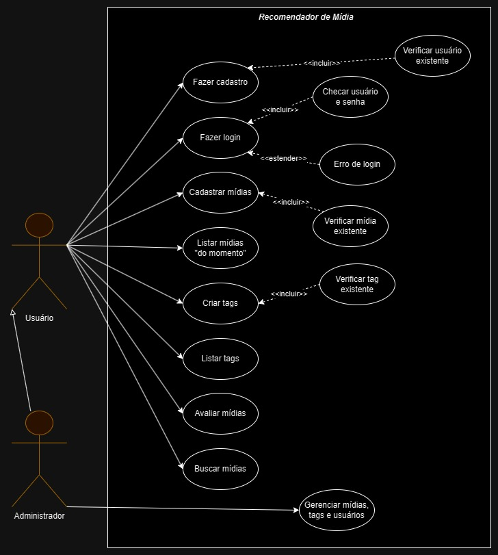

# Especificações do Projeto

A definição do problema e os pontos mais relevantes  a serem tratados nesse projeto foi a consolidação através de observação das necessidades dos indivíduos em ter uma platatorma de categorização, avaliação e sujestão de filmes, seríes e jogos, com TAGS associadas as mídias.

## Personas

## Bruna Tavares

Idade: 35

Ocupação: Gerente de Recursos Humanos, funcionária de uma multinacional do setor de alimentos e bebidas. Casada, reside em uma grande capital do país.

Aplicativos:

● Instagram

● Facebook

● LinkedIn

Motivações

● Família

● Estudos

● Vontade de vencer

Frustrações

● País

● Falta de Oportunidade

● Falta de Empatia pelos colegas de trabalho

Hobbies, História

● Assitir Filmes e Séries

● Reunir com a família nos finais de semana

## João Batista

Idade: 40

Ocupação: Microempresário, com um pequeno comércio especializado em manutenção e vendas de máquinas de lavar usadas e peças não utilizadas. Casado, reside em uma cidade do interior de Minas Gerais.

Aplicativos:

● Facebook

● Instagram

● Aplicativos de bancos

Motivações

● Estar com a família

● Buscar rendas extras

Frustrações

● Não conseguir chegar nos objetivos determinados

Hobbies, História

● Jogar futebol com o filho

● Jogar FIFA com os amigos.

● Assitir Animes.

## Jose Maria

Idade: 20

Ocupação: Estudante, Solteiro, reside com os familiares em uma grande capital do país.

Aplicativos:

● Letterboxd

● Instagram

● Visual basic

Motivações

● Criar novos projetos

● Buscar rendas extras

● Buscar novos conhecimentos na área em que estuda.

Frustrações

● Não concluir um projeto no prazo estipulado

Hobbies, História

● Jogar jogos de futebol

● Assitir animes e series.

● Tocar guitarra.

## Fernanda Tavares

Idade: 31

Ocupação: Professora, leciona aulas em uma grande universidade especializada em pesquisa e extensão no Brasil. Solteira, residente na cidade de Montes Claros - MG.

Aplicativos:

● Facebook

● Instagram

● Aplicativo Bancário

Motivações

● Ser professora

● Levar o conhecimento a vários alunos

● Buscar novos conhecimentos para agregação

Frustrações

● Não ser respeitada como professora

● Sua profissão não ser valorizada, pela sua importância

Hobbies, História

● Leitura

● Viagens

● Assitir e pesquisar sobre séries.

## Ricardo Almeida

Idade: 50

Ocupação: enfermeiro, trabalha em uma policlínica e agente de saúde pública. Casado, residente na cidade do Rio de Janeiro.

Aplicativos:

● Facebook

● Instagram

● Aplicativo Bancário

Motivações

● Se considerar um grande profissional

● Gosta da sua profissão

● Fazer o bem ao próximo

Frustrações

● Não ter conquistado uma graduação.

● Más condições de trabalho.

Hobbies, História.

● Ajudar a cuidar no neto.

● Viagens.

● Assitir filmes.

## Histórias de Usuários

Com base na análise das personas forma identificadas as seguintes histórias de usuários:

|EU COMO... `PERSONA`| QUERO/PRECISO ... `FUNCIONALIDADE` |PARA ... `MOTIVO/VALOR`                 |
|--------------------|------------------------------------|----------------------------------------|
|Bruna Tavares       | Cadastrar filmes e séries assistidas          | Compartilhar experiencias com os usuários sobre séries e filmes             |
|João Batista     | Atualizar dados e opiniar sobre os novos lances e jogadas do FIFA                 | Compartilhar aos usuários, informações sobre o jogo |
|José Maria| Dar notas referente a uma determinada série assitida| Para melhor entendimento e interesse do usuário|
|Fernanda Tavares| Pesquisar sobre novas séries lançadas recentemente | Uma nova experiência de novas séries|
|Ricardo Almeida| Cadastrar informações sobre um determinado filme assistido| Compartilhar aos usuários cadastrados toda a informação sobre o filme|

## Requisitos

As tabelas que se seguem apresentam os requisitos funcionais e não funcionais que detalham o escopo do projeto.

### Requisitos Funcionais

|ID    | Descrição do Requisito  | Prioridade |
|------|-----------------------------------------|----|
|RF-001| O sistema deve permitir cadastro de usuário.  | ALTA | 
|RF-002| O sistema deve permitir login do usuário.  | ALTA  |
|RF-003| O sistema deve permitir o usuário cadastrar filmes, séries, jogos e animanção. | ALTA | 
|RF-004| O sistema deve permitir ao usuário criar TAGs a serem aplicadas a cada tipo de mídia.   | ALTA |
|RF-005| O sistema deve listar as tags por ordem de 'força'.| ALTA | 
|RF-006| Os usuários criam tags.| ALTA |
|RF-007| O sistema deve listar os favoritos.  | MEDIA |
|RF-008| O sistema deve permitir exibir o perfil do usuário. | MEDIA | 
|RF-009| O sistema deve permitir exibir o perfil da mídia.  | ALTA |
|RF-010| O sistema deve permitir o usuário fazer e exibir comentários. | MEDIA | 
|RF-011| O sistema deve listar as mídias para consumir. | ALTA |
|RF-012| O sistema deve permitir buscas de mídias. | ALTA | 
|RF-013| O sistema deve exibir as mídias top 10.  | MEDIA |
|RF-014| O sistema deve exibir as tag "do momento". | MEDIA |

### Requisitos não Funcionais

|ID     | Descrição do Requisito  |Prioridade |
|-------|-------------------------|----|
|RNF-001| A aplicação deve ter senhas de acesso e identificação para os usuários. | ALTA | 
|RNF-002| Os dados pessoais devem ser armazenados sob Lei Geral de Proteção de Dados Pessoais (LGPD). |  ALTA | 
|RNF-003| O sistema deve funcionar nos principais navegadores, como Chrome, Firefox, Edge e Opera. |  ALTA |
|RNF-004| O site deve estar disponível e acessível para os usuários 24 horas por dia, 7 dias por semana, com um tempo de inatividade planejado mínimo para manutenção. |  ALTA | 
|RNF-005| O site deverá ser fácil de usar, eficiente e acessível. |  ALTA |
|RNF-006| Os dados do usuário devem ser armazenados e transmitidos de forma segura, utilizando criptografia forte. |  ALTA | 

## Restrições

O projeto está restrito pelos itens apresentados na tabela a seguir.

|ID| Restrição                                             |
|--|-------------------------------------------------------|
|RE - 01| O projeto deverá ser entregue até o final do semestre letivo. |
|RE - 02| O aplicativo deve se restringir às tecnologias básicas da Web no Frontend. |
|RE - 03| A equipe não pode subcontratar o desenvolvimento do trabalho. |

## Diagrama de Casos de Uso

## Backlog do Projeto e Sprints

As tarefas serão divididas por sprint de acordo com a necessidade, a fim de que todos os integrantes do projeto possam atuar em todas as frentes do sistema, tanto na documentação quanto no desenvolvimento front-end e back-end.
O backlog atual do projeto, bem como a roadmap de sprints podem ser visualizados nas figuras abaixo.

## Wireframes

As images seguintes apresentam um wireframe das principais páginas.

Página principal

Página Midias

Página TAGS

Página Favoritos

Página do usuário 

